<!--
  GitHub Profile README for 7H-ANKUR (Ankur Pratap Singh)
  Public repo named exactly: 7H-ANKUR
  Animated SVGs: avi-ascii.svg (portrait), info-card.svg (neofetch panel), contrib-heatmap.svg (graph)
-->

<!-- Animated ASCII portrait + Neofetch info panel side by side -->
<table>
<tr>
<td valign="top"></td>
<td valign="top"></td>
</tr>
</table>

## Ankur Pratap Singh

**B.Tech CSE (AI) '28 · ML Engineer · Inverthon 2.0 Winner 🏆**

  
  
  
  
  

 

<!-- Profile view counter — same page_id as before, count continues from where it left off -->

  

<!-- Animated contribution heatmap — refreshed daily by GitHub Actions -->

